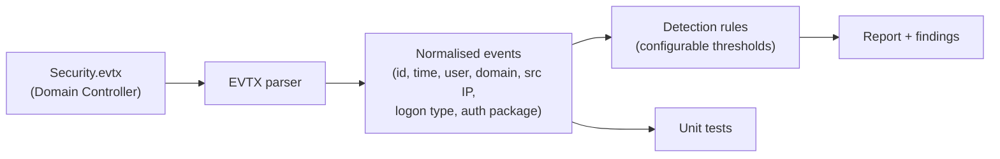

# AD Authentication-Log Detection

A small, tested Python tool that parses **Windows Security authentication events**
(4624 / 4625 / 4672) and applies transparent detection rules for common Active Directory
credential attacks — brute force, password spraying, and successful logons that follow a burst
of failures. It grew out of a lab exercise: exporting a Domain Controller's Security log and
analysing the authentication activity in Python.

## Why I built this

After building an [AD pentest lab](../active-directory-pentest-lab) and seeing what attacker
enumeration and spraying look like from the offensive side, I wanted to understand the
**defensive** side: what those attacks leave behind in Windows authentication telemetry, and
how you'd detect them. The key architectural insight is that **for domain authentication
attacks, the Domain Controller's Security log is the authoritative telemetry source** — a
workstation only sees its own local logons.

## What it does



| Detection | Shape it catches | Default threshold |
|-----------|------------------|-------------------|
| `brute_force` | many 4625 failures against **one** account | ≥ 5 failures |
| `password_spray` | one source IP failing against **many** accounts | ≥ 5 distinct accounts |
| `success_after_failures` | 4624 success after a burst of 4625 failures | ≥ 3 failures / 10 min |
| `privileged_logon` | 4672 special-privilege logons (review surface) | any |

## Example output

Run against the committed synthetic dataset (no real logs needed):

```
$ python detect_ad_attacks.py --json sample_data/synthetic_events.json
```

```
ACTIVE DIRECTORY AUTHENTICATION ANALYSIS
==========================================
Total events analysed : 23
Failed logons  (4625) : 18
Successful     (4624) : 4
Privileged     (4672) : 1
...
DETECTIONS
------------------------------------------
  [CRITICAL] success_after_failures success for corp.local\carol after 5 failures within 10m
  [HIGH    ] brute_force            9 failed logons (4625) for account corp.local\bob
  [HIGH    ] password_spray         source 10.0.0.99 failed against 6 distinct accounts
  [INFO    ] privileged_logon       1 privileged logon(s) (4672) for corp.local\svc-admin
```

Full example: [`sample_data/example_report.txt`](sample_data/example_report.txt).

## Usage

```bash
# Synthetic data (stdlib only):
python detect_ad_attacks.py --json sample_data/synthetic_events.json

# Real Domain Controller log (requires python-evtx):
python detect_ad_attacks.py --evtx path/to/Security.evtx

# Tune thresholds:
python detect_ad_attacks.py --json sample_data/synthetic_events.json \
    --brute-force-threshold 10 --spray-distinct-accounts 8
```

## Status & limitations

**What is complete and verified:**
- Detection rules are implemented as pure functions and **unit-tested** (13 tests) against
  synthetic events covering positive and negative cases.
- The EVTX-to-normalised-event **field mapping is unit-tested** against representative Windows
  Security event XML.
- The tool produces meaningful, reproducible detections on the committed synthetic dataset.

**What remains (honest scope):**
- End-to-end validation against a **live Domain Controller `Security.evtx`** is the next step.
  In the original lab I exported DC logs and set up the transfer, but had not completed the
  full DC-based detection run; that final validation is future work.
- These are simple threshold rules, **not** a SIEM, EDR, or ML model, and not tuned against
  production baselines.

## What this demonstrates

Python (stdlib, dataclasses, argparse) · clean module separation · **unit testing** with
pytest · Windows Security event schema (4624/4625/4672) · detection-engineering thinking
(attack shapes, thresholds, FP/FN trade-offs) · the workstation-vs-DC telemetry distinction.

**What it does not demonstrate:** production SOC/SIEM/EDR experience, or detection tuned on
real enterprise data.

## Reproduce

```bash
python -m venv .venv && source .venv/bin/activate   # Windows: .venv\Scripts\activate
pip install -r requirements.txt                     # python-evtx (real logs) + pytest
python sample_data/generate_synthetic.py            # regenerate synthetic dataset
pytest -q                                            # run the tests
python detect_ad_attacks.py --json sample_data/synthetic_events.json
```

## Project structure

```
ad-auth-log-detection/
├── detect_ad_attacks.py     # CLI entry point
├── src/
│   ├── events.py            # normalised event model
│   ├── evtx_parser.py       # Security.evtx -> normalised events (python-evtx)
│   ├── detections.py        # detection rules (pure, tested)
│   └── report.py            # text report renderer
├── sample_data/             # synthetic dataset + generator + example report
├── tests/                   # pytest suite
├── data/README.md           # data handling / schema
└── requirements.txt
```

## Disclaimer

Educational detection-engineering project developed against a private lab. No real
credentials or captured logs are included.
